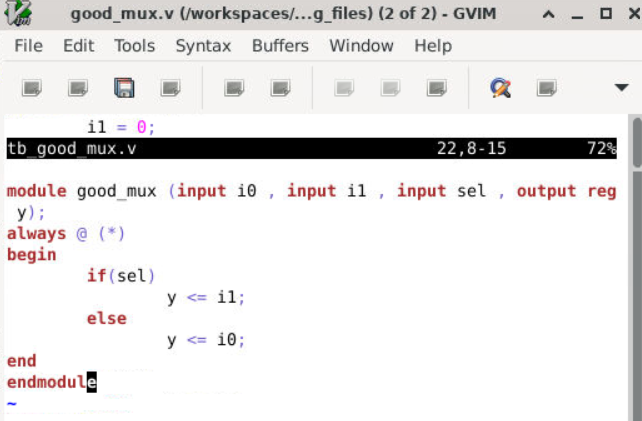
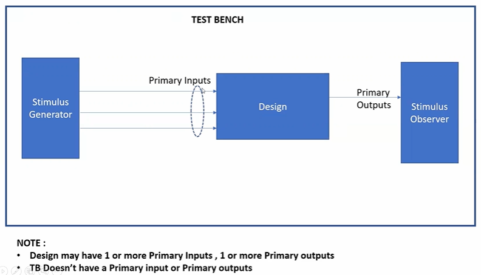
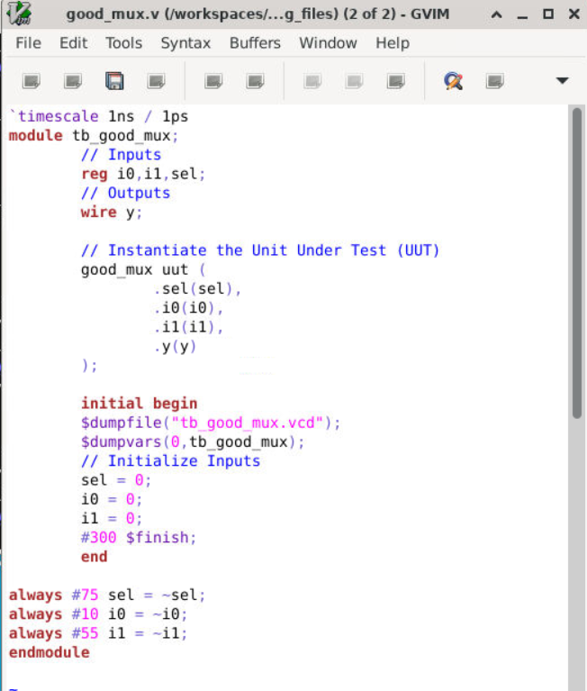

# Day 1 – Introduction to Verilog RTL Design and Synthesis

Day 1 focused on understanding the complete RTL design flow using open-source VLSI tools.

The goal was to learn:

* How Verilog RTL describes digital hardware
* How simulation verifies functionality
* How synthesis converts RTL into gate-level hardware
* How Sky130 standard cells are used during synthesis

---

# 1. Understanding Simulator, Design, and Testbench

Before implementing any digital hardware physically, the design must first be verified in software.
In RTL design flow, three important components are used:

* Design
* Simulator
* Testbench

These components help ensure that the digital circuit behaves correctly before synthesis and hardware fabrication.

---

## Simulator

A simulator is a software tool used to verify whether the RTL design behaves according to the required functionality.

Instead of directly building hardware, the design is first simulated by applying different input combinations and observing the outputs.

### What does the simulator do?

* Applies input signals to the design
* Continuously monitors changes in inputs
* Evaluates outputs whenever inputs change
* Detects logical and functional errors
* Verifies whether the design satisfies the required specification

### Important Observation

* If input changes → output gets evaluated
* If input does not change → output remains the same

Simulation helps engineers debug and verify the circuit before actual hardware implementation.

### Why is simulation important?

Simulation helps:

* Save hardware cost
* Detect design mistakes early
* Verify logic functionality
* Debug circuits easily using waveforms

---

## Design

The design is the actual Verilog RTL code implementing the required digital logic functionality.

RTL (Register Transfer Level) describes how the digital circuit behaves.

### RTL Representation

```text
RTL Code → Digital Logic Circuit
```

The RTL code defines:

* Inputs
* Outputs
* Internal logic behavior
* Data flow inside the circuit

### Example Used in This Lab

The `good_mux.v` file implements a 2:1 multiplexer.

* When `sel = 0` → output follows `i0`
* When `sel = 1` → output follows `i1`

### RTL Design File

```markdown

```

---

## Testbench

A testbench is used to apply stimulus (test vectors) to the RTL design and verify whether the outputs are correct.

The testbench acts like a virtual environment around the design.

### Functions of Testbench

* Generates input signals
* Applies different test conditions
* Observes output behavior
* Automates functional verification

### Verification Flow

```text
Stimulus Generator → Design → Output Observer
```

### Why is a testbench required?

RTL code alone cannot confirm whether the circuit works correctly.

The testbench helps:

* Verify functionality automatically
* Apply multiple input combinations
* Check expected outputs
* Observe signal transitions during simulation

### Important Notes

* A design may contain one or more primary inputs and outputs
* The testbench itself does not have primary inputs or outputs
* The testbench wraps around the design and drives the simulation

### Testbench Overview

```markdown

```

### Testbench File

```markdown

```


# 2. RTL Simulation using Iverilog and GTKWave

## Simulation Flow

```text
Design + Testbench
        ↓
     Iverilog
        ↓
      VCD File
        ↓
     GTKWave
```

### Why are we doing simulation?

Simulation helps check whether the design behaves correctly before synthesis and hardware implementation.

### Why GTKWave?

GTKWave visualizes waveform activity stored inside `.vcd` files.

Waveforms help observe:

* Input changes
* Output transitions
* Timing behavior
* Functional correctness

---

## Commands Used

Clone repository:

```bash
git clone https://github.com/kunalg123/sky130RTLDesignAndSynthesisWorkshop.git
```

Move to Verilog files:

```bash
cd sky130RTLDesignAndSynthesisWorkshop/verilog_files
```

Compile design:

```bash
iverilog good_mux.v tb_good_mux.v
```

Run simulation:

```bash
./a.out
```

View waveform:

```bash
gtkwave tb_good_mux.vcd
```

---

## Verilog Design – good_mux

```verilog
module good_mux (
    input i0,
    input i1,
    input sel,
    output reg y
);

always @(*)
begin
    if(sel)
        y <= i1;
    else
        y <= i0;
end

endmodule
```

### Observation

* When `sel = 0`, output follows `i0`
* When `sel = 1`, output follows `i1`

Waveforms verified correct multiplexer functionality.

---

# 3. Introduction to Logic Synthesis

RTL code is only a behavioral description.

Real hardware requires:

* Logic gates
* Standard cells
* Physical hardware implementation

Synthesis converts RTL code into gate-level hardware representation.

## Synthesis Flow

```text
RTL + Standard Cell Library
              ↓
             Yosys
              ↓
            Netlist
```

---

## Why Standard Cell Libraries are Required

The `.lib` file contains actual hardware cells like:

* AND gates
* OR gates
* Multiplexers
* Buffers
* Flip-flops

These are the real hardware building blocks used during chip implementation.

---

## Why Different Cell Flavors Exist

Different designs require tradeoffs between:

* Speed
* Power
* Area

Fast cells:

* Lower delay
* Higher performance
* More power and area

Slow cells:

* Lower power
* Smaller area
* Useful for fixing hold timing

---

## Timing Concepts

### Setup Timing

```math
Tclk > Tcq-A + Tcomb + Tsetup-B
```

### Hold Timing

```math
Thold-B < Tcq-A + Tcomb
```

### Maximum Frequency

```math
fmax = 1/Tclk(min)
```

These timing equations determine the maximum operating speed of the circuit.

---

# 4. Synthesis using Yosys

Yosys is an open-source synthesis tool used to convert RTL into gate-level netlists.

## Commands Used

Start Yosys:

```bash
yosys
```

Read liberty file:

```bash
read_liberty -lib ../my_lib/lib/sky130_fd_sc_hd__tt_025C_1v80.lib
```

Read Verilog design:

```bash
read_verilog good_mux.v
```

Synthesize top module:

```bash
synth -top good_mux
```

Technology mapping:

```bash
abc -liberty ../my_lib/lib/sky130_fd_sc_hd__tt_025C_1v80.lib
```

View synthesized circuit:

```bash
show
```

Generate netlist:

```bash
write_verilog good_mux_netlist.v
```

Generate simplified netlist:

```bash
write_verilog -noattr good_mux_netlist.v
```

---

# 5. Post-Synthesis Verification

After synthesis, the generated netlist is verified again using the same testbench.

## Verification Flow

```text
Netlist + Testbench
         ↓
      Iverilog
         ↓
       VCD
         ↓
     GTKWave
```

Why is this needed?

* Synthesis internally optimizes logic
* Functional behavior must still remain correct
* Post-synthesis verification ensures synthesized hardware matches RTL behavior

---

# Tools Used

* Iverilog
* GTKWave
* Yosys
* Sky130 Standard Cell Library
* GVim

---

# Day 1 Summary

In Day 1, I learned the complete RTL-to-gate-level design flow using open-source VLSI tools.

Key learnings:

* Understanding simulator, design, and testbench
* RTL simulation using Iverilog
* Waveform analysis using GTKWave
* Introduction to logic synthesis
* Importance of standard cell libraries
* Setup and hold timing concepts
* Fast cells vs slow cells
* Synthesis using Yosys
* Gate-level netlist generation
* Post-synthesis verification

This day provided the foundation for understanding how Verilog RTL is converted into actual digital hardware implementation.

---

# Workshop Repository

Original works

