# Day 2 – Timing Libraries, Hierarchical vs Flat Synthesis & Efficient Flip-Flop Coding Styles

Welcome to Day 2 of the **RTL Design and Synthesis Workshop using SKY130 PDK**.  
This session focuses on understanding how synthesis tools interpret timing libraries, optimize logic, preserve hierarchy, and infer sequential hardware from Verilog RTL descriptions.

In this day, we explored:

* SKY130 timing libraries (`.lib`)
* Standard-cell Verilog models
* Liberty timing characterization
* Standard-cell drive strengths
* Hierarchical vs Flat synthesis
* Logic optimization during synthesis
* Various flip-flop coding styles
* Simulation and waveform analysis
* RTL synthesis flow using Yosys

---

# Contents

1. Introduction to Timing Libraries  
2. SKY130 PDK Overview  
3. Understanding `tt_025C_1v80`  
4. Exploring the `.lib` File  
5. Standard Cell Verilog Models  
6. Hierarchical vs Flat Synthesis  
7. Logic Optimization During Synthesis  
8. Flip-Flop Coding Styles  
9. Simulation Flow using Icarus Verilog  
10. Synthesis Flow using Yosys  
11. Waveform Analysis  
12. Key Learnings  

---

# 1. Introduction to Timing Libraries

Timing libraries are one of the most important components in ASIC design flow because they describe how standard cells behave electrically and logically under different operating conditions.

The SKY130 library explored in this workshop:

```bash
sky130_fd_sc_hd__tt_025C_1v80.lib
````

The `.lib` file contains:

* propagation delay information
* transition timing
* leakage power
* internal switching power
* capacitance data
* area information
* timing constraints

These libraries are used by:

* synthesis tools
* STA (Static Timing Analysis) tools
* optimization engines
* technology mapping tools

During synthesis, the `.lib` file helps the tool:

* choose suitable standard cells
* estimate timing delays
* optimize critical paths
* calculate power and area
* perform gate-level mapping

Without Liberty files:

* timing analysis cannot be performed
* synthesis cannot map RTL to real hardware cells
* ASIC implementation becomes impossible

---

# 2. SKY130 PDK Overview

The SKY130 PDK is an open-source Process Design Kit based on SkyWater’s 130nm CMOS technology.

It provides:

* standard-cell libraries
* transistor models
* timing libraries
* physical layout data
* SPICE models

Used in:

* RTL-to-GDSII ASIC flow
* synthesis
* timing analysis
* physical design

The SKY130 library contains hundreds of characterized standard cells such as:

* AND gates
* OR gates
* multiplexers
* buffers
* inverters
* flip-flops

Each standard cell includes:

* functional Verilog models
* Liberty timing models
* physical layout views
* SPICE transistor descriptions

---

# 3. Understanding `tt_025C_1v80`

| Parameter | Meaning                |
| --------- | ---------------------- |
| `tt`      | Typical process corner |
| `025C`    | Temperature = 25°C     |
| `1v80`    | Supply voltage = 1.8V  |

This naming convention specifies the operating conditions under which the library was characterized.

---

## Process Corner (`tt`)

The process corner represents transistor behavior after fabrication.

Due to manufacturing variations, transistors fabricated on silicon may not always behave identically. Some chips may become:

* faster
* slower
* leakier

depending on the fabrication process.

`tt` means:

* Typical NMOS transistor
* Typical PMOS transistor

Used for:

* nominal timing analysis
* standard synthesis conditions

Other process corners include:

| Corner | Meaning              |
| ------ | -------------------- |
| `ff`   | Fast NMOS, Fast PMOS |
| `ss`   | Slow NMOS, Slow PMOS |
| `fs`   | Fast NMOS, Slow PMOS |
| `sf`   | Slow NMOS, Fast PMOS |

These corners are used to verify whether the circuit works correctly under different manufacturing conditions.

---

### Example

Suppose an inverter delay is:

| Process Corner | Delay  |
| -------------- | ------ |
| `ff`           | `14ps` |
| `tt`           | `20ps` |
| `ss`           | `30ps` |

This means:

* fast transistors switch quicker
* slow transistors increase propagation delay

ASIC designers must ensure the circuit works correctly in all corners.

---

## Temperature (`025C`)

Defines the operating temperature during characterization.

Temperature directly affects:

* transistor mobility
* switching speed
* leakage current
* propagation delay

Higher temperature generally:

* increases delay
* increases leakage power
* reduces switching speed

---

### Example

Suppose an AND gate delay is:

| Temperature | Delay  |
| ----------- | ------ |
| `25°C`      | `40ps` |
| `85°C`      | `55ps` |
| `125°C`     | `70ps` |

As temperature increases:

* transistor switching becomes slower
* timing paths become longer

---

### Leakage Power Example

| Temperature | Leakage Current |
| ----------- | --------------- |
| `25°C`      | Low             |
| `85°C`      | Medium          |
| `125°C`     | High            |

This becomes critical in:

* low-power chips
* battery-operated devices
* mobile processors

---

## Voltage (`1v80`)

Defines the operating supply voltage.

Voltage affects:

* switching speed
* timing performance
* dynamic power consumption
* noise margins

Higher voltage:

* improves switching speed
* reduces propagation delay
* increases dynamic power consumption

Lower voltage:

* reduces power
* slows transistor switching

---

### Example

Suppose a NAND gate delay is:

| Voltage | Delay  |
| ------- | ------ |
| `1.8V`  | `35ps` |
| `1.5V`  | `45ps` |
| `1.2V`  | `60ps` |

At lower voltage:

* transistors switch slower
* timing delay increases

---

### Dynamic Power Relation

Dynamic power approximately follows:

```text
P ∝ V²
```

This means:

* increasing voltage improves speed
* but power consumption increases rapidly

For example:

* moving from `1.2V` → `1.8V`
  can significantly increase dynamic power consumption.

---

## Why These Conditions Matter

The same standard cell behaves differently under:

* different process corners
* different temperatures
* different voltages

Therefore, ASIC designers must verify timing under multiple operating conditions to ensure reliable chip functionality.

This process is called:

* PVT Analysis

Where:

* `P` → Process
* `V` → Voltage
* `T` → Temperature

# 4. Exploring the `.lib` File

## Library Preview

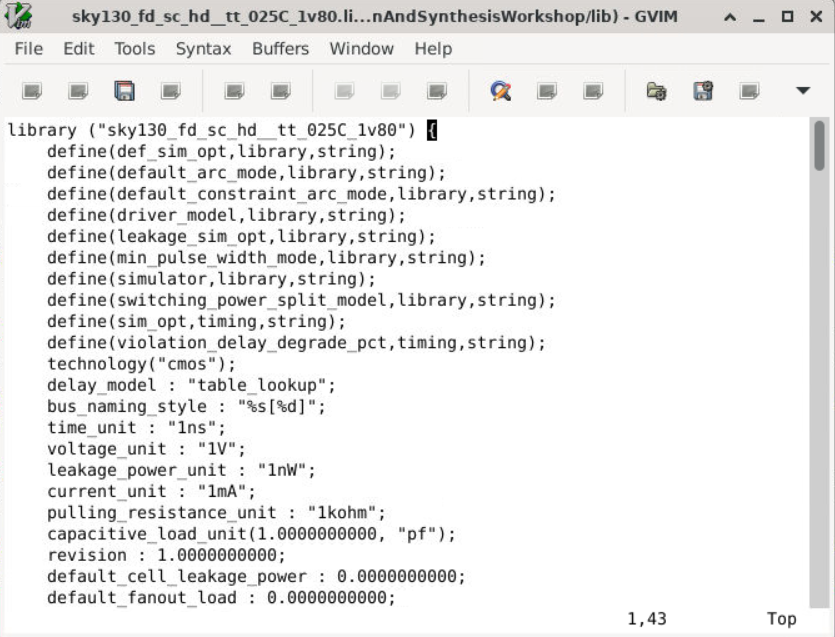

The Liberty timing library stores the characterization data for all standard cells available in the SKY130 standard-cell library.

Example:

```liberty
cell ("sky130_fd_sc_hd__and2_4")
````

This cell entry contains:

* timing behavior
* leakage power
* silicon area
* capacitance information
* transition delay
* logical functionality

for the AND gate standard cell.

The synthesis tool reads this information to:

* estimate delays
* optimize timing
* calculate power
* choose suitable cells
* map RTL into real hardware gates

---

## Logic Function Definition

Example logic function inside the library:

```liberty
function : "(A&B)";
```

This represents:

```text
X = A & B
```

The output becomes HIGH only when:

* `A = 1`
* `B = 1`

The synthesis tool uses this function to understand:

* logical behavior
* gate functionality
* Boolean equivalence during optimization

---

# Important Sections in `.lib`

## Leakage Power

```liberty
leakage_power ()
```

Represents static power consumed even when the gate is idle.

Leakage power occurs because transistors are not perfect switches and always allow a very small leakage current to flow.

Important in:

* low-power ASICs
* battery-operated devices
* mobile processors
* standby mode optimization

---

## Area

```liberty
area : 8.7584000000;
```

Defines the physical silicon area occupied by the standard cell.

Area directly affects:

* chip size
* routing congestion
* manufacturing cost

Smaller cells:

* reduce silicon usage
* reduce chip cost

Larger cells:

* improve timing
* provide stronger drive capability

---

## Capacitance

```liberty
capacitance : 0.0024120000;
```

Capacitance represents the electrical load seen by the previous stage.

Higher capacitance:

* increases propagation delay
* slows transitions
* increases dynamic power consumption

Capacitance data is used during:

* timing analysis
* slew estimation
* optimization

---

## Timing Information

```liberty
cell_rise
cell_fall
rise_transition
fall_transition
```

Used for:

* setup analysis
* hold analysis
* delay calculation
* timing closure

---

### `cell_rise`

Defines propagation delay when output changes:

* LOW → HIGH

---

### `cell_fall`

Defines propagation delay when output changes:

* HIGH → LOW

---

### `rise_transition`

Defines output rise slew characteristics.

---

### `fall_transition`

Defines output fall slew characteristics.

These timing parameters are critical for:

* meeting setup timing
* meeting hold timing
* calculating path delays
* timing optimization

---

# Timing Lookup Tables

The timing values are stored using:

* `index_1`
* `index_2`
* `values`

Where:

| Parameter | Meaning            |
| --------- | ------------------ |
| `index_1` | Input slew         |
| `index_2` | Output capacitance |
| `values`  | Delay values       |

The synthesis and STA tools use these lookup tables to estimate delays under different loading conditions.

Example:

* large output capacitance
* slow input transition

→ larger propagation delay

---

# Standard Cell Drive Strengths

The same logic gate exists in multiple drive strengths inside the SKY130 standard-cell library.

Example AND gate cells:

| Cell     | Drive Strength    |
| -------- | ----------------- |
| `and2_0` | Weak drive        |
| `and2_1` | Medium drive      |
| `and2_2` | Strong drive      |
| `and2_4` | Very strong drive |

All implement the same Boolean logic:

```text
X = A & B
```

However, they differ in:

* transistor sizing
* timing performance
* power consumption
* silicon area
* fanout capability

---

## Drive Strength Comparison from SKY130 Library

| Parameter               | `and2_0`            | `and2_1`        | `and2_2`                 | `and2_4`                   |
| ----------------------- | ------------------- | --------------- | ------------------------ | -------------------------- |
| Logic Function          | `X = A & B`         | `X = A & B`     | `X = A & B`              | `X = A & B`                |
| Relative Drive Strength | Weak                | Medium          | Strong                   | Very Strong                |
| Approximate Area        | `6.256000`          | `8.758400`      | `15.014400`              | `23.772800`                |
| Relative Speed          | Slowest             | Moderate        | Faster                   | Fastest                    |
| Relative Delay          | Highest             | Medium          | Lower                    | Lowest                     |
| Dynamic Power           | Lowest              | Medium          | Higher                   | Highest                    |
| Leakage Power           | Lowest              | Medium          | Higher                   | Highest                    |
| Transistor Size         | Smallest            | Small           | Large                    | Largest                    |
| Load Driving Capability | Low                 | Medium          | High                     | Very High                  |
| Fanout Capability       | Small loads         | Moderate loads  | Medium fanout            | Large fanout               |
| Typical Usage           | Non-critical paths  | General logic   | Medium critical paths    | Critical timing paths      |
| Area Consumption        | Smallest            | Small           | Large                    | Largest                    |
| Timing Performance      | Poor                | Moderate        | Good                     | Best                       |
| Optimization Goal       | Area & Power Saving | Balanced Design | Performance Optimization | Maximum Timing Performance |

---

## Understanding the Tradeoff

As drive strength increases:

* transistor width increases
* output current increases
* propagation delay decreases
* power consumption increases
* silicon area increases

Smaller cells like `and2_0` are used for:

* low-power regions
* non-critical timing paths
* small fanout loads

Larger cells like `and2_4` are used for:

* critical timing paths
* large capacitive loads
* high fanout nets

During synthesis, the tool automatically selects different drive-strength cells depending on:

* timing requirements
* output load
* fanout
* optimization goals

This process is called:

* cell sizing
* drive strength optimization

---

# 5. Standard Cell Verilog Models

## Verilog Model of AND Gate


The Verilog behavioral model describes only the logical functionality of the standard cell.

Example:

```verilog
and and0 (and0_out_X, A, B);
buf buf0 (X, and0_out_X);
```

Function:

```text
X = A & B
```

The Verilog model is mainly used for:

* RTL simulation
* functional verification
* gate-level simulation

while the `.lib` file is used for:

* timing analysis
* power estimation
* technology mapping

---

# Wrapper Modules

The SKY130 library contains:

* `and2_0`
* `and2_1`
* `and2_2`
* `and2_4`

These are wrapper modules around the base AND gate.

Example:

```verilog
module sky130_fd_sc_hd__and2_4
```

The wrapper changes:

* transistor sizing
* drive strength

but functionality remains identical.

---

## Wrapper Module Comparison

| Module   | Drive Strength | Typical Usage                         |
| -------- | -------------- | ------------------------------------- |
| `and2_0` | Weak           | Small loads and non-critical paths    |
| `and2_1` | Medium         | General logic paths                   |
| `and2_2` | Strong         | Moderate fanout and optimized timing  |
| `and2_4` | Very Strong    | Critical timing paths and heavy loads |

This allows the synthesis tool to select different versions of the same logic gate depending on:

* timing requirements
* fanout
* output capacitance
* optimization goals

---

# USE_POWER_PINS

The models support:

```verilog
`ifdef USE_POWER_PINS
```

Including:

* VPWR
* VGND
* VPB
* VNB

These represent:

* power supply
* ground
* well bias connections

Used in:

* full ASIC integration
* power-aware simulation
* physical implementation
* gate-level verification

---

# Functional vs Behavioral Models

The models also contain:

```verilog
`ifdef FUNCTIONAL
```

---

## Functional Model

* simplified logic-only simulation
* faster simulation runtime
* ignores detailed electrical behavior

Used during:

* RTL debugging
* early verification

---

## Behavioral / Power-Aware Model

Includes:

* power-good checking
* realistic ASIC behavior
* power dependency modeling

Used during:

* gate-level simulation
* detailed verification
* ASIC signoff analysis

These models behave more realistically and help detect:

* power connectivity issues
* invalid power conditions
* incorrect cell behavior under power failure
---

# 6. Hierarchical vs Flat Synthesis

Synthesis tools can synthesize RTL designs using:
- hierarchical synthesis
- flat synthesis

Both approaches generate functionally correct hardware, but the optimization strategy differs significantly.

Hierarchical synthesis preserves module boundaries, while flat synthesis removes hierarchy to optimize the complete design globally.

---

# Hierarchical Synthesis

In hierarchical synthesis:
- module hierarchy is preserved
- each module is synthesized independently
- module boundaries remain visible after synthesis

This approach is commonly used in:
- large ASIC projects
- modular RTL design
- reusable IP-based designs

because it simplifies:
- debugging
- incremental design updates
- hierarchical verification

---

## Advantages

* faster synthesis runtime
* easier debugging
* modular design flow
* simpler RTL tracing
* reusable module structure

---

## Disadvantages

* limited cross-module optimization
* reduced timing optimization opportunities
* redundant logic may remain across modules

---

## Hierarchical Netlist

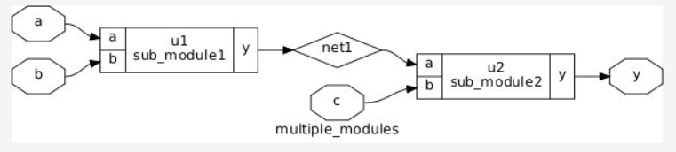

The module boundaries are preserved after synthesis.

Each RTL module remains as a separate synthesized block, making the design easier to:
- understand
- debug
- modify

However, the synthesis tool cannot fully optimize logic across different modules because hierarchy is maintained.

---

# Flat Synthesis

In flat synthesis:
- all hierarchy is collapsed
- module boundaries are removed
- the entire design becomes a single logic block

This allows the synthesis tool to:
- view the entire circuit globally
- optimize logic across module boundaries
- eliminate redundant hardware

Flat synthesis is mainly used when:
- maximum timing optimization is required
- aggressive area optimization is needed
- performance is more important than modularity

---

## Advantages

* better optimization
* reduced redundant logic
* improved timing opportunities
* better area optimization
* global logic simplification

---

## Disadvantages

* difficult debugging
* larger netlists
* slower synthesis runtime
* higher memory usage
* harder RTL tracing

---

## Flat Netlist

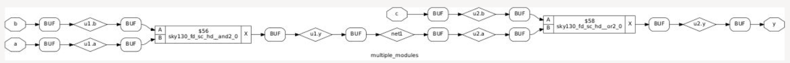

All modules are merged into one synthesized netlist.

The synthesis tool treats the complete design as a single logic block and performs:
- global optimization
- logic restructuring
- gate minimization
- timing improvement

This can significantly improve timing performance but reduces readability of the synthesized design.

---

# Hierarchical vs Flat Comparison

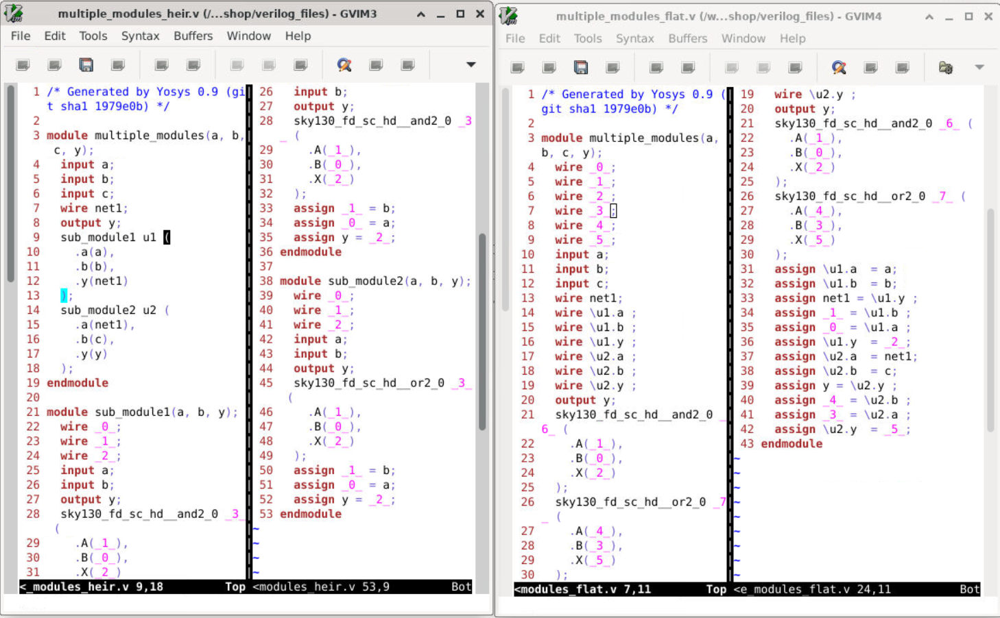

| Feature | Hierarchical | Flat |
|---|---|---|
| Hierarchy | Preserved | Removed |
| Runtime | Faster | Slower |
| Debugging | Easier | Harder |
| Optimization | Limited | Better |
| Netlist Structure | Modular | Complex |
| Memory Usage | Lower | Higher |
| Timing Optimization | Moderate | Strong |
| RTL Traceability | Easier | Difficult |
| Cross-Module Optimization | Limited | Extensive |
| Typical Usage | Large modular designs | Timing-critical designs |

---

# Multiple Module Example

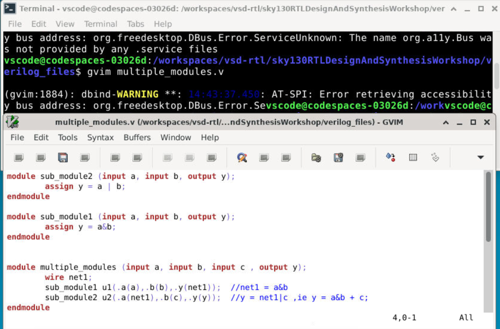

This example demonstrates:
- module hierarchy
- interconnection between modules
- synthesis behavior
- hierarchy preservation
- flattening during synthesis

In hierarchical synthesis:
- each module is synthesized separately

In flat synthesis:
- all modules are merged into one optimized design

This demonstrates how synthesis strategy affects:
- optimization quality
- netlist complexity
- debugging capability

---

# 7. Logic Optimization During Synthesis

One important observation from Day 2 is that synthesis tools automatically optimize logic while preserving functionality.

Even if RTL is written one way, the synthesized gate-level implementation may look completely different internally while still producing the same output behavior.

Synthesis tools perform optimizations to improve:
- timing
- area
- power consumption
- hardware efficiency

---

# Multiplication Optimization

Arithmetic operations written in RTL are often simplified internally by the synthesis tool.

When multiplication is performed using powers of 2, synthesis tools replace multiplication hardware with shift operations because shifting requires significantly less hardware.

---

## Multiplication by 2

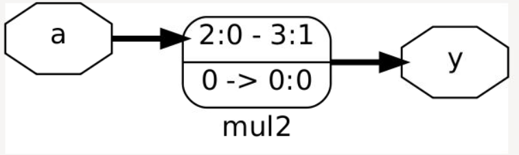

RTL:

```verilog id="n6ndvc"
assign y = a * 2;
````

Optimized as:

```text id="x4edkz"
y = a << 1
```

Left shifting by 1 bit is equivalent to multiplying by 2.

Instead of generating:

* multiplier hardware
* complex arithmetic circuitry

the synthesis tool uses:

* simple wiring shifts

which reduces:

* area
* delay
* power consumption

---

# Multiplication by 8

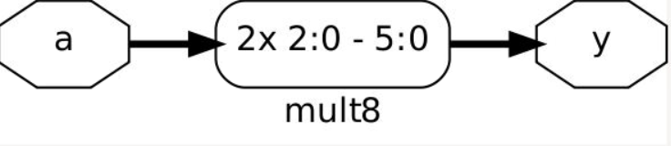

RTL:

```verilog id="5mb1qq"
assign y = a * 8;
```

Optimized as:

```text id="4mxjlwm"
y = a << 3
```

Left shifting by 3 bits is equivalent to multiplying by 8.

This optimization avoids unnecessary arithmetic hardware and improves implementation efficiency.

---

# RTL Used for Multiplication

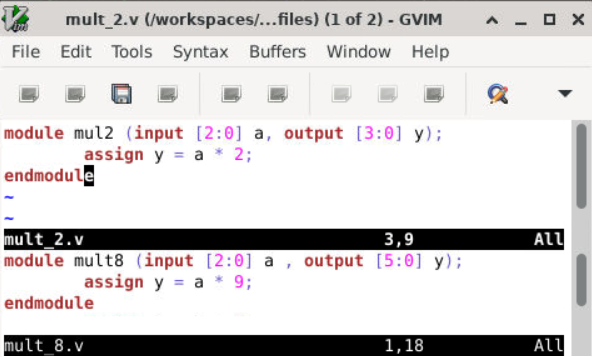

The synthesis tool detects multiplication by powers of 2 and automatically replaces them with shift operations.

This optimization reduces:

* silicon area
* hardware complexity
* power consumption
* propagation delay

This is one of the most common arithmetic optimizations performed during synthesis.

---

# Logic Equivalence

Even though internal gates change, functionality remains identical.

Example Boolean equivalence:

```text id="th3j5v"
A + B = (A' · B')'
```

This equation is derived from:

* De Morgan’s Law

It shows that:

* an OR gate
  can be implemented using:
* NAND gates

---

## NAND-Based Optimization

An OR gate may internally be synthesized using NAND gates because NAND gates are:

* faster
* smaller
* easier to manufacture
* commonly optimized in standard-cell libraries

For example:

| Logic Function | Possible Internal Implementation |
| -------------- | -------------------------------- |
| OR Gate        | NAND + Inverters                 |
| AND Gate       | NAND + Inverter                  |
| XOR Gate       | Combination of NAND Gates        |

This is why synthesized hardware may differ significantly from:

* RTL structure
* original gate descriptions

while still maintaining:

* identical logical behavior

This process is called:

* logic optimization
* Boolean optimization
* gate-level optimization

and is one of the most important tasks performed by synthesis tools.

---

#8. RTL Codes for Various Flip-Flop Styles

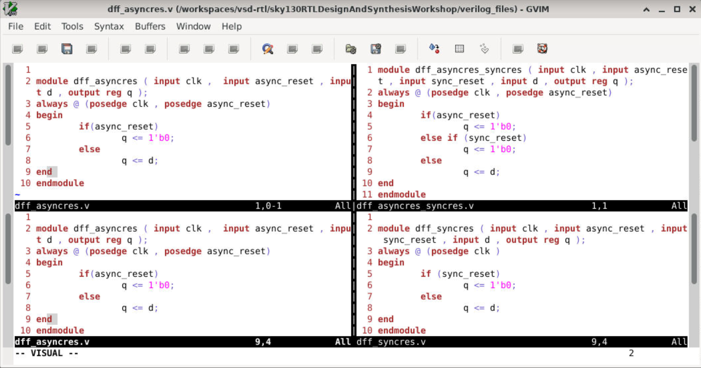

The above image contains RTL implementations for four different flip-flop coding styles:

- Asynchronous Reset D Flip-Flop
- Asynchronous + Synchronous Reset D Flip-Flop
- Synchronous Reset D Flip-Flop
- Asynchronous Set D Flip-Flop

The difference between these designs mainly depends on:
- sensitivity list
- reset/set condition placement
- clock dependency

These small RTL differences result in different synthesized sequential hardware structures during synthesis.

---

# Asynchronous Reset D Flip-Flop

In asynchronous reset design:
- reset is included in the sensitivity list
- reset acts immediately without waiting for clock edge

Example sensitivity list:

```verilog
always @(posedge clk , posedge async_reset)
````

Behavior:

| Signal Condition  | Output Behavior               |
| ----------------- | ----------------------------- |
| `async_reset = 1` | Output resets immediately     |
| `posedge clk`     | Output captures input `D`     |
| Clock inactive    | Output retains previous value |

---

## Synthesized Hardware

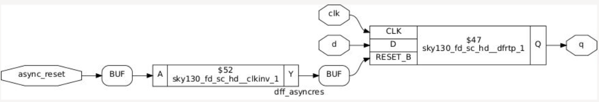

The synthesis tool infers:

* D Flip-Flop
* asynchronous reset circuitry

---

# Asynchronous Set D Flip-Flop

In asynchronous set design:

* set signal is included in the sensitivity list
* output becomes HIGH immediately when set is active

Example sensitivity list:

```verilog
always @(posedge clk , posedge async_set)
```

Behavior:

| Signal Condition | Output Behavior                 |
| ---------------- | ------------------------------- |
| `async_set = 1`  | Output becomes HIGH immediately |
| `posedge clk`    | Output captures input `D`       |
| Clock inactive   | Output retains previous value   |

---

## Synthesized Hardware

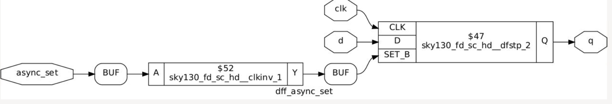

The synthesized hardware contains:

* asynchronous set circuitry
* D Flip-Flop storage element

---

# Synchronous Reset D Flip-Flop

In synchronous reset design:

* reset is checked only during active clock edge
* reset operation depends on clock transition

Example sensitivity list:

```verilog
always @(posedge clk)
```

Behavior:

| Signal Condition            | Output Behavior       |
| --------------------------- | --------------------- |
| `posedge clk` + `reset = 1` | Output resets         |
| `posedge clk` + `reset = 0` | Output captures input |
| No clock edge               | Output unchanged      |

---

## Synthesized Hardware

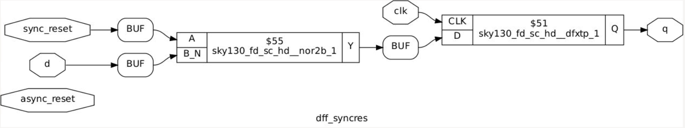

Synchronous resets are commonly preferred in:

* FPGA designs
* synchronous digital systems
* pipelined architectures

because they simplify:

* timing analysis
* synchronization
* timing closure

---

# Async + Sync Reset DFF

In this design:

* asynchronous reset acts immediately
* synchronous reset works only during clock edge

This combines both reset mechanisms in a single sequential circuit.

---

## Combined Reset Behavior

| Condition                                  | Operation                     |
| ------------------------------------------ | ----------------------------- |
| Asynchronous reset active                  | Immediate reset               |
| Synchronous reset active during clock edge | Clocked reset                 |
| Normal operation                           | Flip-Flop captures input data |

---

## Synthesized Hardware

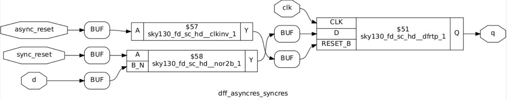

This demonstrates how synthesis tools infer more advanced sequential hardware directly from RTL descriptions.

---

# 9. Simulation Flow using Icarus Verilog

Simulation was performed using:

* Icarus Verilog
* GTKWave

Simulation is important because it verifies:

* logical correctness
* sequential behavior
* reset functionality
* waveform timing

before synthesis and hardware implementation.

---

# Compilation

```bash id="qup77d"
iverilog dff_asyncres.v tb_dff_asyncres.v
```

This command:

* compiles RTL code
* compiles testbench
* generates simulation executable

---

# Run Simulation

```bash id="5gwxpg"
./a.out
```

This executes the compiled simulation and generates:

* waveform dump files
* signal activity data

---

# Open Waveforms

```bash id="7ctgw2"
gtkwave tb_dff_asyncres.vcd
```

GTKWave is used to visualize:

* clock transitions
* reset behavior
* signal timing
* sequential outputs

Waveform analysis helps verify whether the RTL behaves as expected.

---

# 10. Waveform Analysis

## Simulation Output 1

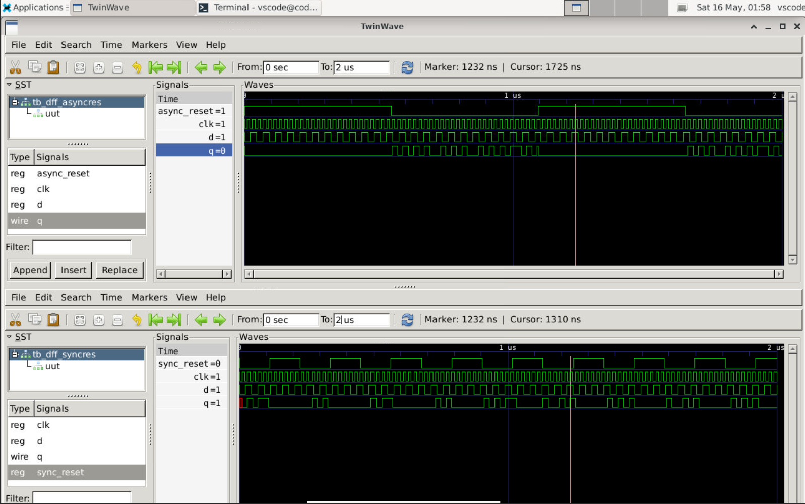

---

## Simulation Output 2

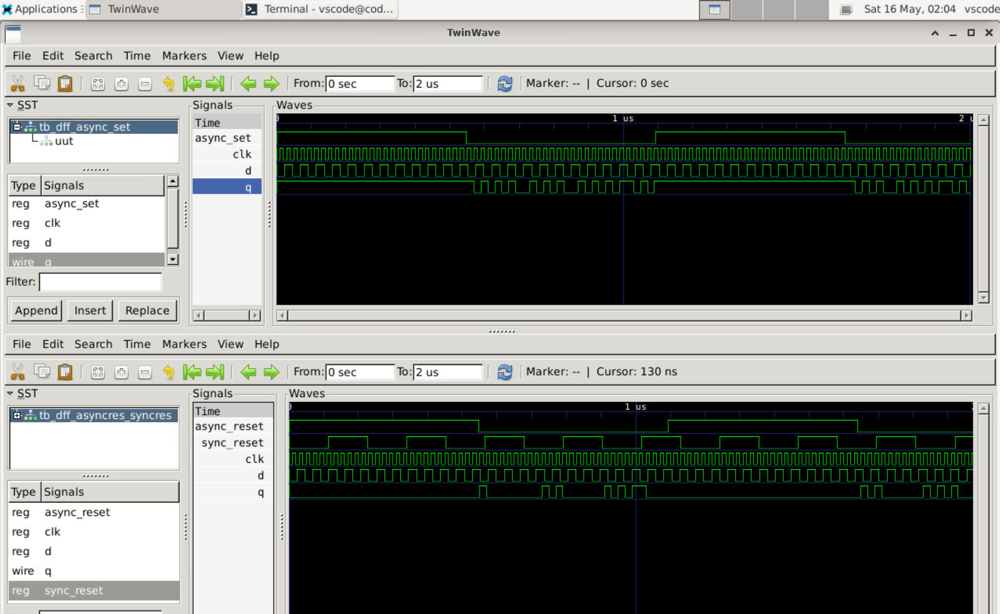

---

## Async Set Waveform

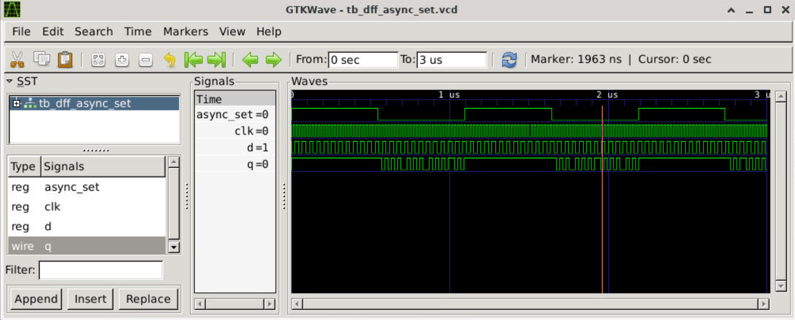

The waveforms verify:

* clock-triggered operation
* reset behavior
* set behavior
* sequential storage
* data capturing on clock edges

---

## Waveform Observations

### Clock Signal

* drives sequential operation
* determines data capture timing

---

### Reset Signal

* forces known output state
* initializes sequential logic

---

### Output Signal

* changes only on valid triggering conditions
* stores previous value between clock edges

Waveform analysis is extremely important in digital design because it helps identify:

* incorrect reset behavior
* timing issues
* functional bugs
* unexpected state transitions

---

# 11. Synthesis Flow using Yosys

Yosys is an open-source RTL synthesis tool used to convert Verilog RTL into synthesized gate-level hardware.

The synthesis flow includes:

* RTL parsing
* logic optimization
* flip-flop inference
* technology mapping
* gate-level netlist generation

---

# Start Yosys

```bash id="pd0w26"
yosys
```

Launches the Yosys synthesis environment.

---

# Read Liberty Library

```bash id="s9a69f"
read_liberty -lib sky130_fd_sc_hd__tt_025C_1v80.lib
```

Loads the SKY130 standard-cell timing library.

Used for:

* timing-aware synthesis
* standard-cell mapping
* optimization decisions

---

# Read RTL

```bash id="k5v7q6"
read_verilog dff_asyncres.v
```

Reads the Verilog RTL design into Yosys.

---

# Run Synthesis

```bash id="b7psvx"
synth -top dff_asyncres
```

Performs:

* RTL elaboration
* logic optimization
* flip-flop inference
* netlist generation

---

# Flip-Flop Mapping

```bash id="jlwm5q"
dfflibmap -liberty sky130_fd_sc_hd__tt_025C_1v80.lib
```

Maps RTL flip-flops into real SKY130 sequential standard cells.

This step converts generic RTL flip-flops into:

* technology-specific hardware cells

---

# Technology Mapping

```bash id="mecaj5"
abc -liberty sky130_fd_sc_hd__tt_025C_1v80.lib
```

Performs:

* gate mapping
* logic optimization
* standard-cell selection
* Boolean optimization

The `abc` optimization engine minimizes:

* area
* delay
* logic complexity

while preserving functionality.

---

# Visualize Netlist

```bash id="0k5e4r"
show
```

Displays synthesized gate-level schematic.

This visualization helps understand:

* inferred hardware
* gate connections
* optimization results
* synthesized logic structure

---

# 12. Key Learnings

By the end of Day 2, the following concepts became clear:

* Timing libraries are essential for synthesis and STA
* Standard cells exist in multiple drive strengths
* Liberty files contain timing, power, capacitance, and area data
* Synthesis tools optimize hardware automatically
* Hierarchical and flat synthesis have different tradeoffs
* RTL coding style directly affects synthesized hardware
* Flip-flop inference depends on always block structure
* Multiplication by powers of 2 gets optimized into shift operations
* Functional behavior remains identical even if internal hardware structure changes
* Technology mapping converts RTL into real standard-cell implementations

---

# Tools Used

| Tool           | Purpose                 |
| -------------- | ----------------------- |
| Icarus Verilog | RTL simulation          |
| GTKWave        | Waveform viewing        |
| Yosys          | RTL synthesis           |
| SKY130 PDK     | Standard-cell libraries |

---

# Conclusion

Day 2 provided a deeper understanding of how synthesis tools convert RTL descriptions into optimized gate-level hardware.

This workshop demonstrated:

* how Liberty timing libraries guide synthesis
* how standard cells are characterized
* how synthesis tools optimize logic internally
* how sequential hardware is inferred from RTL
* how simulation verifies hardware behavior
* how technology mapping converts RTL into SKY130 standard cells

These concepts form the foundation of:

* ASIC synthesis
* timing analysis
* gate-level implementation
* physical design
* RTL optimization
* sequential logic design
