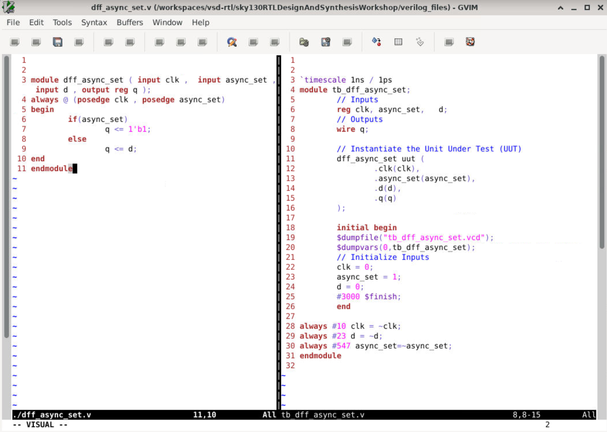

# Day 2 – Timing Libraries, Hierarchical vs Flat Synthesis & Efficient Flip-Flop Coding Styles

Welcome to Day 2 of the **RTL Design and Synthesis Workshop using SKY130 PDK**.
This session focuses on understanding how synthesis tools interpret timing libraries, optimize logic, and infer sequential hardware from Verilog RTL descriptions.

In this day, we explored:

* SKY130 timing libraries (`.lib`)
* Standard-cell Verilog models
* Hierarchical vs Flat synthesis
* Logic optimization during synthesis
* Various flip-flop coding styles
* Simulation and waveform analysis
* Synthesis flow using Yosys

---

# Contents

1. Introduction to Timing Libraries
2. SKY130 PDK Overview
3. Understanding `tt_025C_1v80`
4. Exploring the `.lib` File
5. Standard Cell Verilog Models
6. Hierarchical vs Flat Synthesis
7. Logic Optimization During Synthesis
8. Flip-Flop Coding Styles
9. Simulation Flow using Icarus Verilog
10. Synthesis Flow using Yosys
11. Waveform Analysis
12. Key Learnings

---

# 1. Introduction to Timing Libraries

Timing libraries are one of the most important components in ASIC design flow.

The SKY130 library explored in this workshop:

```bash
sky130_fd_sc_hd__tt_025C_1v80.lib
```

The `.lib` file contains:

* propagation delay information
* transition timing
* leakage power
* internal switching power
* capacitance data
* area information
* timing constraints

These libraries are used by:

* synthesis tools
* STA tools
* optimization engines

---

# 2. SKY130 PDK Overview

The SKY130 PDK is an open-source Process Design Kit based on SkyWater’s 130nm CMOS technology.

It provides:

* standard-cell libraries
* transistor models
* timing libraries
* physical layout data
* SPICE models

Used in:

* RTL-to-GDSII ASIC flow
* synthesis
* timing analysis
* physical design

---

# 3. Understanding `tt_025C_1v80`

| Parameter | Meaning                |
| --------- | ---------------------- |
| `tt`      | Typical process corner |
| `025C`    | Temperature = 25°C     |
| `1v80`    | Supply voltage = 1.8V  |

This naming convention specifies the operating conditions under which the library was characterized.

---

# 4. Exploring the `.lib` File

## Library Preview


The Liberty timing library stores the characterization data for all standard cells.

Example:

```liberty
cell ("sky130_fd_sc_hd__and2_4")
```

This defines:

* timing behavior
* leakage power
* area
* capacitance
* transition delay

for the AND gate standard cell.

---

# Important Sections in `.lib`

## Leakage Power

```liberty
leakage_power ()
```

Represents static power consumed even when the cell is idle.

---

# Area

```liberty
area : 8.7584000000;
```

Defines silicon area occupied by the cell.

---

# Timing Information

```liberty
cell_rise
cell_fall
rise_transition
fall_transition
```

Used for:

* setup analysis
* hold analysis
* delay calculation

---

# Timing Lookup Tables

The timing values are stored using:

* `index_1`
* `index_2`
* `values`

Where:

| Parameter | Meaning            |
| --------- | ------------------ |
| `index_1` | Input slew         |
| `index_2` | Output capacitance |
| `values`  | Delay values       |

---

# Standard Cell Drive Strengths

The same logic gate exists in multiple strengths:

| Cell     | Drive Strength |
| -------- | -------------- |
| `and2_0` | Weak drive     |
| `and2_2` | Medium drive   |
| `and2_4` | Strong drive   |

All implement the same logic:

[
X = A \cdot B
]

X=A\cdot B

But differ in:

* speed
* power
* area
* load-driving capability

---

# 5. Standard Cell Verilog Models

## Verilog Model of AND Gate


The Verilog behavioral model describes only the logical functionality.

Example:

```verilog
and and0 (and0_out_X, A, B);
buf buf0 (X, and0_out_X);
```

Function:

[
X = A \land B
]

X=A\land B

---

# Wrapper Modules

The SKY130 library contains:

* `and2_0`
* `and2_2`
* `and2_4`

These are wrapper modules around the base AND gate.

Example:

```verilog
module sky130_fd_sc_hd__and2_4
```

The wrapper changes:

* transistor sizing
* drive strength

but functionality remains identical.

---

# USE_POWER_PINS

The models support:

```verilog
`ifdef USE_POWER_PINS
```

Including:

* VPWR
* VGND
* VPB
* VNB

These represent:

* power supply
* ground
* well bias connections

Used in full ASIC integration.

---

# Functional vs Behavioral Models

The models also contain:

```verilog
`ifdef FUNCTIONAL
```

## Functional Model

* simplified logic-only simulation

## Behavioral / Power-Aware Model

Includes:

* power-good checking
* realistic ASIC behavior

---

# 6. Hierarchical vs Flat Synthesis

Synthesis tools can synthesize RTL designs using:

* hierarchical synthesis
* flat synthesis

---

# Hierarchical Synthesis

In hierarchical synthesis:

* module hierarchy is preserved
* modules are synthesized separately

---

## Advantages

* faster synthesis
* easier debugging
* modular design flow

---

## Disadvantages

* limited cross-module optimization

---

## Hierarchical Netlist


The module boundaries are preserved after synthesis.

---

# Flat Synthesis

In flat synthesis:

* all hierarchy is collapsed
* design becomes a single logic block

---

## Advantages

* better optimization
* reduced redundant logic
* improved timing opportunities

---

## Disadvantages

* difficult debugging
* larger netlists
* slower synthesis runtime

---

## Flat Netlist


All modules are merged into one netlist.

---

# Hierarchical vs Flat Comparison


| Feature      | Hierarchical | Flat    |
| ------------ | ------------ | ------- |
| Hierarchy    | Preserved    | Removed |
| Runtime      | Faster       | Slower  |
| Debugging    | Easier       | Harder  |
| Optimization | Limited      | Better  |
| Netlist      | Modular      | Complex |

---

# Multiple Module Example


This example demonstrates:

* module hierarchy
* interconnection
* synthesis behavior

during hierarchical and flat synthesis.

---

# 7. Logic Optimization During Synthesis

One important observation from Day 2:

## Synthesis tools optimize logic automatically.

Even if RTL is written one way, synthesized hardware may look completely different internally while producing the same functionality.

---

# Multiplication Optimization

## Multiplication by 2


RTL:

```verilog
assign y = a * 2;
```

Optimized as:

[
y = a << 1
]

y=a\ll1

---

# Multiplication by 8


RTL:

```verilog
assign y = a * 8;
```

Optimized as:

[
y = a << 3
]

y=a\ll3

---

# RTL Used for Multiplication


The synthesis tool detects multiplication by powers of 2 and replaces them with shift operations.

This optimization reduces:

* area
* hardware complexity
* power consumption

---

# Logic Equivalence

Even though internal gates change, functionality remains identical.

Example:

[
A + B = (A' \cdot B')'
]

A+B=(A'\cdot B')'

An OR gate can internally be implemented using NAND gates.

This is why synthesized hardware may differ from RTL structure.

---

# 8. Flip-Flop Coding Styles

Different RTL coding styles infer different sequential hardware.

---

# Asynchronous Reset D Flip-Flop

## RTL Code


Example:

```verilog
always @(posedge clk, posedge async_reset)
```

If reset becomes HIGH:

* output resets immediately
* independent of clock

---

## Synthesized Hardware


The synthesis tool infers:

* D Flip-Flop
* asynchronous reset circuitry

---

# Asynchronous Set D Flip-Flop

## RTL Code



When async_set becomes HIGH:

* output becomes 1 immediately

---

## Synthesized Hardware


The synthesized hardware contains:

* asynchronous set logic

---

# Synchronous Reset D Flip-Flop


In synchronous reset:

* reset is checked only during clock edge

Unlike asynchronous reset:

* reset waits for active clock edge

---

# Async + Sync Reset DFF


This design combines:

* asynchronous reset
* synchronous reset

showing how more complex sequential logic is synthesized.

---

# 9. Simulation Flow using Icarus Verilog

Simulation was performed using:

* Icarus Verilog
* GTKWave

---

# Compilation

```bash
iverilog dff_asyncres.v tb_dff_asyncres.v
```

---

# Run Simulation

```bash
./a.out
```

---

# Open Waveforms

```bash
gtkwave tb_dff_asyncres.vcd
```

---

# 10. Waveform Analysis

## Simulation Output 1


---

## Simulation Output 2


---

## Async Set Waveform


The waveforms verify:

* clock-triggered operation
* reset behavior
* set behavior
* sequential storage

---

# 11. Synthesis Flow using Yosys

## Start Yosys

```bash
yosys
```

---

# Read Liberty Library

```bash
read_liberty -lib sky130_fd_sc_hd__tt_025C_1v80.lib
```

---

# Read RTL

```bash
read_verilog dff_asyncres.v
```

---

# Run Synthesis

```bash
synth -top dff_asyncres
```

---

# Flip-Flop Mapping

```bash
dfflibmap -liberty sky130_fd_sc_hd__tt_025C_1v80.lib
```

Maps RTL flip-flops to real SKY130 standard cells.

---

# Technology Mapping

```bash
abc -liberty sky130_fd_sc_hd__tt_025C_1v80.lib
```

Performs:

* gate mapping
* optimization
* standard-cell selection

---

# Visualize Netlist

```bash
show
```

Displays synthesized gate-level schematic.

---

# 12. Key Learnings

By the end of Day 2, the following concepts became clear:

* Timing libraries are essential for synthesis and STA
* Standard cells exist in multiple drive strengths
* Liberty files contain timing, power, and area data
* Synthesis tools optimize hardware automatically
* Hierarchical and flat synthesis have different tradeoffs
* RTL coding style directly affects synthesized hardware
* Flip-flop inference depends on always block structure
* Multiplication by powers of 2 gets optimized into shifts
* Functional behavior can remain same even if hardware structure changes internally

---

# Tools Used

| Tool           | Purpose                 |
| -------------- | ----------------------- |
| Icarus Verilog | RTL simulation          |
| GTKWave        | Waveform viewing        |
| Yosys          | RTL synthesis           |
| SKY130 PDK     | Standard-cell libraries |

---

# Conclusion

Day 2 provided a deeper understanding of how synthesis tools convert RTL into optimized gate-level hardware.

The workshop demonstrated:

* how timing libraries guide synthesis
* how standard cells are characterized
* how synthesis optimizes logic internally
* how sequential elements are inferred from RTL
* how simulation verifies hardware behavior

These concepts form the foundation of:

* ASIC synthesis
* timing analysis
* gate-level design
* physical implementation
* RTL optimization.
