# Day 4 – GLS, Blocking vs Non-Blocking & Synthesis-Simulation Mismatch

Welcome to Day 4 of the **RTL Design and Synthesis Workshop using SKY130 PDK**.
This session focused on Gate Level Simulation (GLS), synthesis-simulation mismatch scenarios, blocking vs non-blocking assignments, and common RTL coding mistakes that lead to unexpected hardware behavior after synthesis.

This day also included hands-on labs using:

* Icarus Verilog
* GTKWave
* Yosys
* SKY130 standard cell libraries

---

# Table of Contents

* Introduction to Gate Level Simulation (GLS)
* Why GLS is Needed
* GLS Flow using Icarus Verilog
* RTL Simulation vs GLS
* Synthesis-Simulation Mismatch
* Missing Sensitivity List
* Blocking vs Non-Blocking Statements
* Comparison of Blocking vs Non-Blocking
* Caveats with Blocking Statements
* Labs and Experiments

  * Ternary Operator MUX
  * Bad MUX
  * Good MUX
  * Blocking Caveat Example
* RTL vs Synthesized Netlists
* Simulation vs GLS Waveforms
* Gate-Level Schematics
* Key Learnings

---

# 1. Introduction to Gate Level Simulation (GLS)

## What is GLS?

GLS stands for:

## Gate Level Simulation

It is the process of running the testbench with the synthesized netlist as the Design Under Test (DUT).

Instead of simulating RTL code directly, GLS simulates:

* synthesized netlists
* standard cell models
* gate-level hardware representation

---

## Important Concept

The synthesized netlist is logically equivalent to RTL code.

This means:

* same functionality should be preserved
* same testbench should work correctly
* RTL output and synthesized output should ideally match

---

## Why GLS is Needed

GLS is used to:

* verify logical correctness after synthesis
* detect synthesis-simulation mismatches
* validate synthesized hardware functionality
* analyze gate-level behavior
* ensure timing correctness

---

# Timing-Aware GLS

For accurate timing verification:

# GLS should be run with delay annotation

This helps in:

* setup/hold analysis
* propagation delay checking
* timing validation

---

## GLS Flow using Icarus Verilog

```text
Design / Netlist + Standard Cell Verilog Models + Testbench
                                ↓
                             Icarus Verilog
                                ↓
                              VCD Dump
                                ↓
                              GTKWave
```

---

# GLS using Icarus Verilog

## RTL Simulation

### Compile RTL and Testbench

```bash
iverilog ternary_operator_mux.v tb_ternary_operator_mux.v
```

### Run Simulation

```bash
./a.out
```

### Open GTKWave

```bash
gtkwave tb_ternary_operator_mux.vcd
```

---

## Gate Level Simulation (GLS)

### Compile Synthesized Netlist with SKY130 Models

```bash
iverilog ../my_lib/verilog_model/primitives.v ../my_lib/verilog_model/sky130_fd_sc_hd.v ternary_operator_mux_netlist.v tb_ternary_operator_mux.v
```

### Run GLS

```bash
./a.out
```

### Open GTKWave

```bash
gtkwave tb_ternary_operator_mux.vcd
```

---

## RTL Simulation vs Gate Level Simulation (GLS)

| Feature                    | RTL Simulation          | Gate Level Simulation       |
| -------------------------- | ----------------------- | --------------------------- |
| DUT                        | RTL Code                | Synthesized Netlist         |
| Abstraction Level          | Behavioral              | Gate-level                  |
| Uses Standard Cells        | No                      | Yes                         |
| Timing Awareness           | Usually no              | Can include delays          |
| Simulation Speed           | Faster                  | Slower                      |
| Main Purpose               | Functional verification | Post-synthesis verification |
| Detects Synthesis Mismatch | Limited                 | Yes                         |

---

## Important Observation

Gate-level Verilog models can be:

* timing aware
* functional only

In this workshop mainly:

## functional GLS

was used.

---

## Example Hardware Mapping

RTL:

```verilog
assign y = (a | b) & c;
```

can synthesize into:

* OR gate
* AND gate

or optimized standard cells after synthesis.

---

# 2. Synthesis-Simulation Mismatch

Even if the netlist is a true representation of RTL,
mismatches can still occur because:

## simulator and synthesizer interpret RTL differently

---

## Common Reasons for Mismatch

* Missing sensitivity list
* Incorrect blocking assignments
* Wrong use of non-blocking assignments
* Non-standard Verilog coding styles
* Improper combinational logic description

---

## Missing Sensitivity List

## How Simulator Works

Simulator works based on:

## activity/events

The always block executes only when signals inside the sensitivity list change.

---

## Example

```verilog
always @(sel)
```

The block executes only when:

```text
sel changes
```

Changes in:

* `i0`
* `i1`

will NOT trigger execution.

This creates incorrect RTL simulation behavior.

---

## Important Observation

## Synthesizer does NOT care about sensitivity list

Synthesizer looks only at:

* logic functionality
* hardware inference

This creates:

## Synthesis-Simulation Mismatch

---

# 3. Blocking vs Non-Blocking Statements

Inside always blocks:

---

## Blocking Assignment (`=`)

### Characteristics

* Executes statements sequentially
* First statement executes before second statement
* Immediate assignment

### Mainly Used For

## combinational logic

---

## Example

```verilog
a = b + c;
d = a + f;
```

Here:

* second statement uses updated value of `a`

Execution is:

## sequential

---

## Non-Blocking Assignment (`<=`)

### Characteristics

* Evaluates all RHS together
* Updates LHS later
* Parallel execution behavior

### Mainly Used For

## sequential logic

---

## Example

```verilog
a <= b + c;
d <= a + f;
```

Both RHS expressions evaluate simultaneously.

This models:

## flip-flop/register behavior

correctly.

---

## Important Rule

### Use:

* `=` for combinational logic
* `<=` for sequential logic

---

## Blocking vs Non-Blocking Assignment Comparison

| Feature              | Blocking (`=`)        | Non-Blocking (`<=`)     |
| -------------------- | --------------------- | ----------------------- |
| Execution Style      | Sequential            | Parallel                |
| Assignment Timing    | Immediate             | Scheduled               |
| Statement Dependency | Order dependent       | Order independent       |
| Used For             | Combinational logic   | Sequential logic        |
| Hardware Modeling    | Logic gates           | Flip-flops/registers    |
| Simulation Behavior  | Executes line-by-line | Evaluates RHS together  |
| Recommended Usage    | `always @(*)`         | `always @(posedge clk)` |

---

# 4. Labs & Experiments

---

# Lab 1 – Ternary Operator MUX

## RTL Code

```verilog
module ternary_operator_mux (
    input i0,
    input i1,
    input sel,
    output y
);

assign y = sel ? i1 : i0;

endmodule
```

---

# Ternary Operator

```verilog
condition ? TRUE : FALSE
```

Implements:

# 2:1 Multiplexer

---

# RTL vs Synthesized Netlist

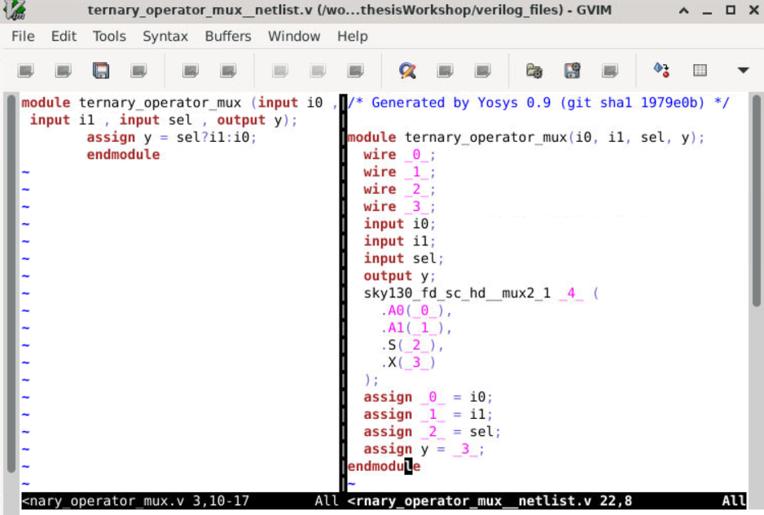

### Observation

* RTL synthesized into SKY130 mux standard cell
* `sky130_fd_sc_hd__mux2_1` inferred successfully
* Synthesized hardware matches RTL functionality

---

# Gate-Level Schematic

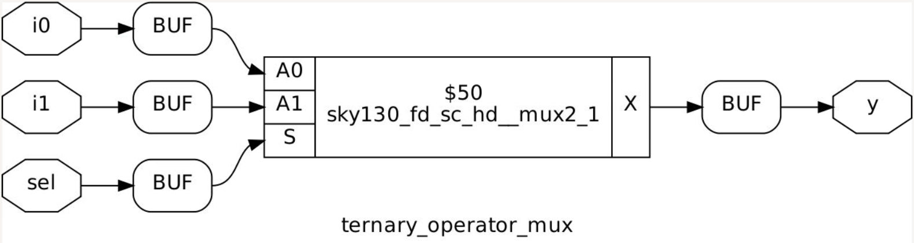

### Observation

* Inputs connected to mux standard cell
* Proper mux hardware generated
* Standard cell implementation verified

---

# RTL vs GLS Waveform

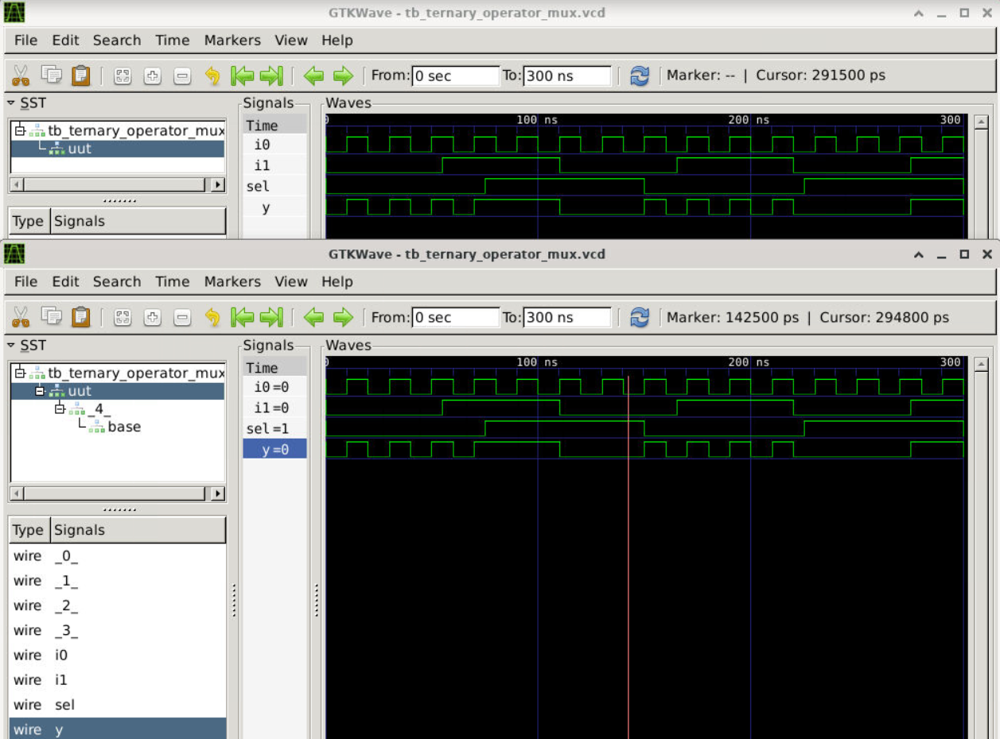

### Observation

* RTL and GLS outputs match correctly
* Functional verification successful
* No mismatch observed

---

# Lab 2 – Bad MUX

## RTL Code

```verilog
module bad_mux (
    input i0,
    input i1,
    input sel,
    output reg y
);

always @(sel)
begin
    if(sel)
        y <= i1;
    else
        y <= i0;
end

endmodule
```

---

# Problems in This RTL

* Missing sensitivity list
* Incorrect use of non-blocking assignment in combinational logic

---

# Why This is Wrong

The block executes only when:

```text
sel changes
```

Changes in:

* `i0`
* `i1`

will not update output properly.

---

# RTL vs Synthesized Netlist

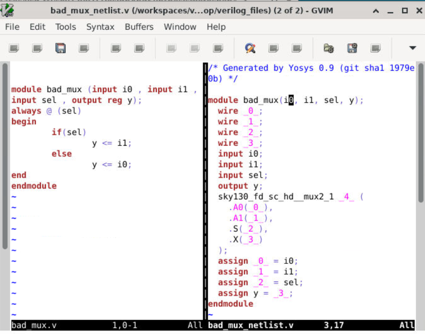

### Observation

* Synthesizer still infers proper mux hardware
* Hardware implementation correct
* Issue exists mainly during simulation

---

# Simulation vs GLS

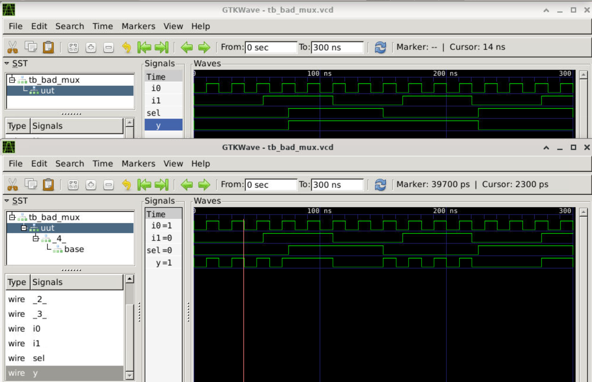

### Observation

* RTL simulation output may not update correctly
* GLS behaves correctly
* Demonstrates synthesis-simulation mismatch

---

# Synthesized Schematic

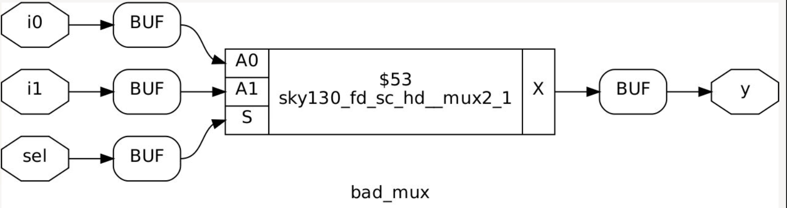

### Observation

* SKY130 mux cell inferred correctly
* Synthesized hardware remains functionally correct

---

# Good MUX vs Bad MUX

| Feature                    | Bad MUX             | Good MUX            |
| -------------------------- | ------------------- | ------------------- |
| Sensitivity List           | `@(sel)`            | `@(*)`              |
| Assignment Type            | Non-blocking (`<=`) | Blocking (`=`)      |
| Combinational Logic Style  | Incorrect           | Correct             |
| RTL Simulation Accuracy    | May fail            | Correct             |
| GLS Output                 | Correct             | Correct             |
| Synthesis Result           | Proper mux inferred | Proper mux inferred |
| Simulation-Synthesis Match | Possible mismatch   | No mismatch         |

---

# Lab 3 – Good MUX

## RTL Code

```verilog
module good_mux (
    input i0,
    input i1,
    input sel,
    output reg y
);

always @(*)
begin
    if(sel)
        y = i1;
    else
        y = i0;
end

endmodule
```

---

# Why This Works

`@(*)` automatically includes:

* `i0`
* `i1`
* `sel`

This ensures:

* proper combinational logic
* correct output updates
* accurate simulation

---

# RTL vs Synthesized Netlist

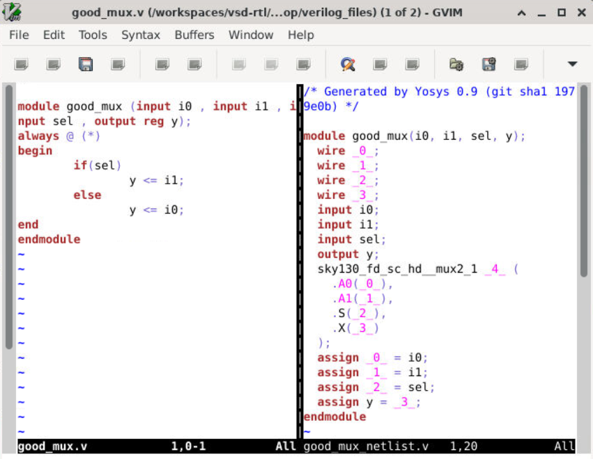

### Observation

* Proper combinational coding style used
* Synthesized mux matches RTL intent
* No mismatch observed

---

# Simulation vs GLS

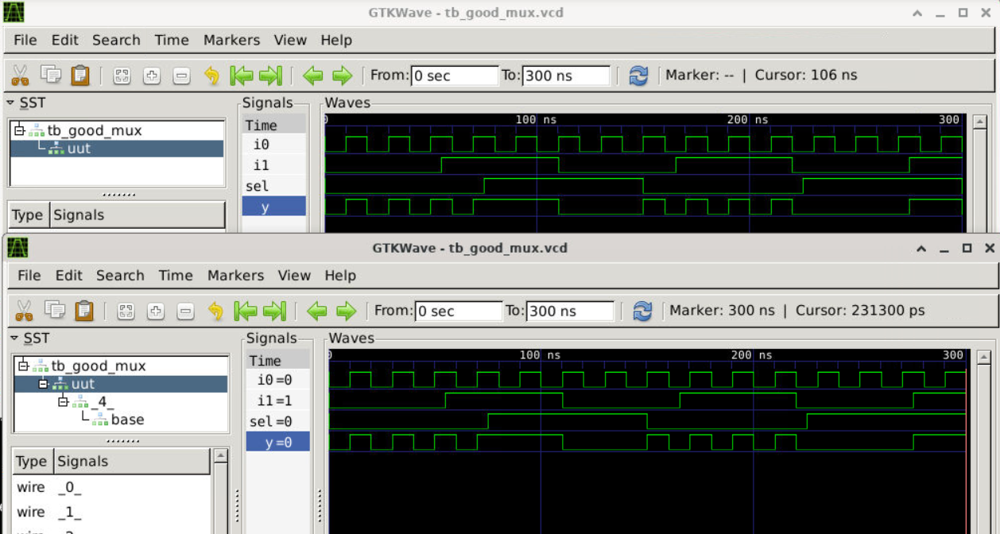

### Observation

* RTL and GLS outputs match perfectly
* Correct combinational behavior verified

---

# Gate-Level Schematic

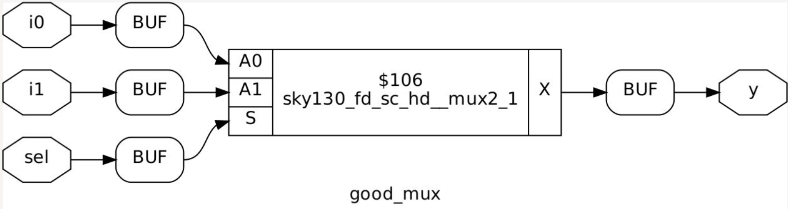

### Observation

* SKY130 mux standard cell inferred successfully

---

# 5. Caveats with Blocking Statements

---

# Sequential Logic Caveat

## Problematic RTL

```verilog
always @(posedge clk)
begin
    q0 = d;
    q  = q0;
end
```

---

# Problem

Execution occurs sequentially:

1. `q0` immediately gets `d`
2. `q` immediately gets updated `q0`

Simulation behaves like:

```text
q = d
```

instead of delayed pipeline behavior.

---

# Correct RTL

```verilog
always @(posedge clk)
begin
    q0 <= d;
    q  <= q0;
end
```

---

# Observation

Non-blocking assignment:

* models flip-flops correctly
* performs parallel register updates
* matches sequential hardware behavior

---

# Combinational Logic Caveat

## Problematic RTL

```verilog
module blocking_caveat (
    input a,
    input b,
    input c,
    output reg d
);

reg x;

always @(*)
begin
    d = x & c;
    x = a | b;
end

endmodule
```

---

# Problem

`d` uses:

# old value of x

because blocking assignments execute sequentially.

---

# Correct RTL

```verilog
always @(*)
begin
    x = a | b;
    d = x & c;
end
```

---

# RTL vs Synthesized Netlist

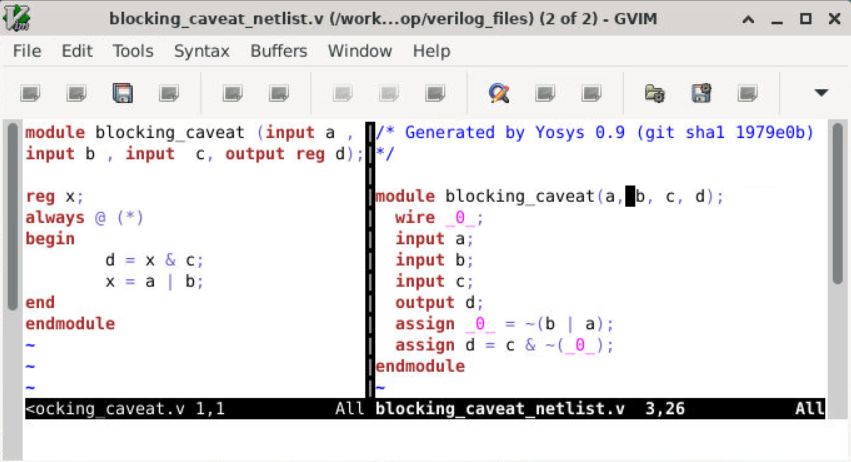

### Observation

* Synthesis optimizes logic correctly
* Hardware implementation simplified
* Simulation affected by statement ordering

---

# Simulation vs GLS

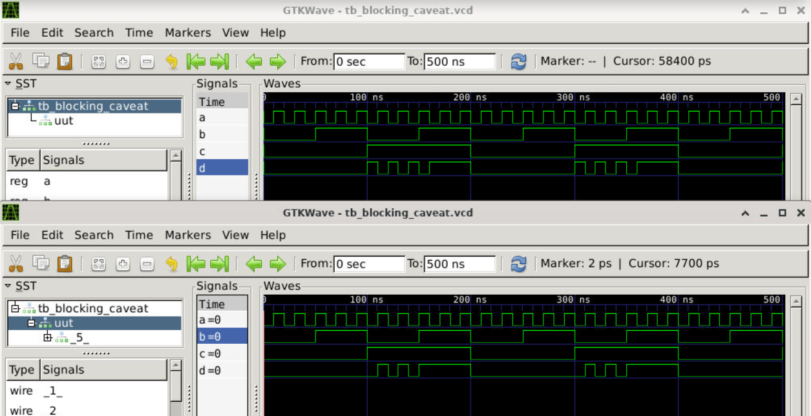

### Observation

* RTL simulation depends on execution order
* GLS follows synthesized hardware behavior
* Blocking assignment caveat demonstrated clearly

---

# Gate-Level Schematic

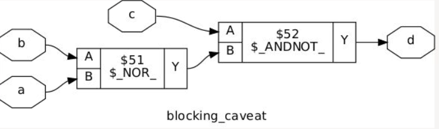

### Observation

* Optimized combinational logic generated successfully

---

# Yosys Synthesis Flow

```text
read_liberty
read_verilog
synth -top
abc -liberty
write_verilog
```

---

# Tools Used

* Icarus Verilog (iverilog)
* GTKWave
* Yosys
* SKY130 Standard Cell Library
* GVim

---

# Repository Contents

This Day 4 repository includes:

* RTL codes
* Testbenches
* GLS outputs
* GTKWave screenshots
* RTL vs synthesized netlists
* Gate-level schematics
* SKY130 standard cell mapping
* Theory notes
* Lab observations

---

# Key Learnings

* GLS verifies synthesized hardware behavior.
* Simulator works based on activity/events.
* Synthesizer ignores sensitivity lists.
* Missing sensitivity lists can cause mismatch.
* Blocking assignments are sequential.
* Non-blocking assignments are parallel.
* `always @(*)` should be used for combinational logic.
* `<=` should be used for sequential logic.
* Poor RTL coding style can create simulation mismatch even when synthesized hardware is correct.
* SKY130 standard cells are inferred during synthesis.

---

# Conclusion

Day 4 provided practical understanding of:

* Gate Level Simulation (GLS)
* RTL vs synthesized hardware comparison
* Synthesis-simulation mismatch
* Blocking and non-blocking assignments
* Combinational and sequential RTL coding styles
* Gate-level verification using SKY130 standard cells

along with hands-on experiments, waveform analysis, synthesized netlists, and gate-level schematic visualization.
